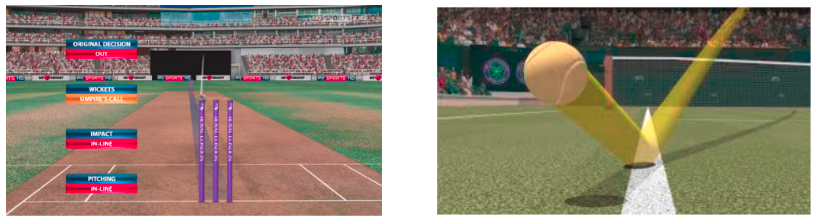
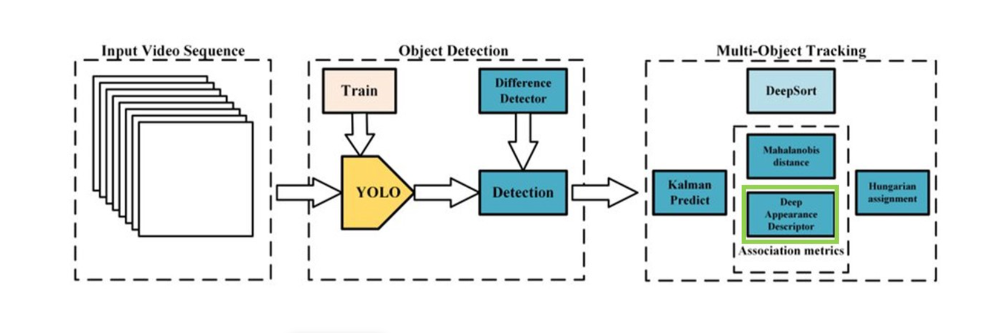
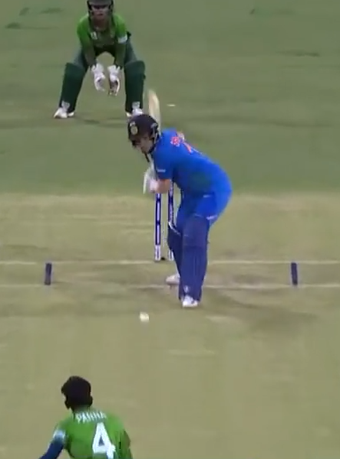
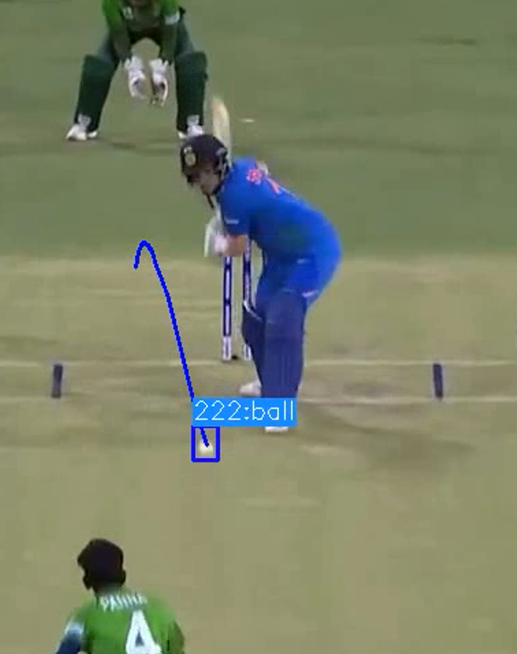

# Object Detection and Tracking 

  The YOLOv7 model is the latest addition to the YOLO (You Only Look Once) family of single-stage object detectors. It incorporates a Darknet backbone to enhance image frames within the YOLO model. The model combines and mixes these features in the neck before transmitting them to the network's head. YOLOv7 predicts the locations and types of objects and generates bounding boxes accordingly. It utilizes non-maximum suppression (NMS) post-processing to refine its final predictions.

One important consideration in YOLOv7 is memory usage and the extent to which gradients need to propagate across layers during back-propagation. Lower gradients facilitate more effective learning in the network. YOLOv7 employs an enhanced version of the ELAN computational block called E-ELAN as its last layer aggregator. Additionally, to accommodate different applications requiring varying precision and inference rates, object detection models are often provided in a series of scaled-up and scaled-down models. YOLOv7 incorporates layer concatenation while scaling both the depth and breadth of the network, preserving optimal model design across different sizes according to ablation studies.

Re-parameterization techniques are used to build a more robust model that captures broader patterns by averaging a group of model weights. Recent research has focused on module-level re-parameterization, where individual network components have their own re-parameterization methods. Gradient flow propagation channels help identify which network modules should or should not employ re-parameterization methods. The YOLOv7 network head is responsible for making final predictions, but due to its downstream position, an auxiliary head may also be included in the middle. This auxiliary head, although not trained as well as the final head, provides additional supervision and detects objects with less network interference.

Once the cricket ball is detected, the tracking stage begins, consisting of two major components: a motion model and state estimation. The Kalman filter (KF) is commonly used for state estimation and predicting the bounding boxes of tracklets in subsequent frames. New frame detections are associated with existing track sets using methodologies like intersection-over-union (IoU) for localization or appearance modeling for re-identification (Re-ID). The KF forecasts the tracklet bounding box in the next frame and correlates it with the detection bounding box.

In order to address challenges related to camera motion and inaccurate bounding box estimations, camera motion compensation (CMC) techniques are employed. This involves estimating camera motion using picture registration and adjusting the Kalman filter accordingly. Furthermore, SORT-like algorithms balance the localization and appearance information trade-off, which impacts the tracker's ability to detect objects (MOTA) and preserve proper identities over time (IDF1).

The key contributions of this study include enhancing tracking-by-detection trackers through innovations such as camera motion compensation-based features tracking and an improved Kalman filter state vector for better box localization. The study also proposes a simple yet effective strategy for fusing IoU and ReID cosine-distance to achieve more robust detection-tracklet associations.

## Table of Contents
- [Software Requirements](#software-requirements)
- [Model Flow Implemented](#Model-Flow-Implemented) 
- [Results](#Results)
  
## Software Requirements
- Python 3.7 or higher
- OpenCV library (version 4.7.0)
- PyTorch library (version 1.0)
- Numpy library (version 1.25.0)
- YOLOv7 pre-trained weights (available at [[link](https://github.com/WongKinYiu/yolov7)])
- Video file or webcam access for input

## Model Flow Implemented

## Results

  
  

